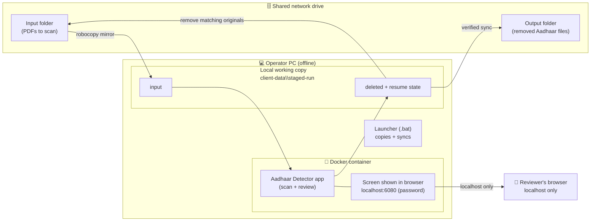
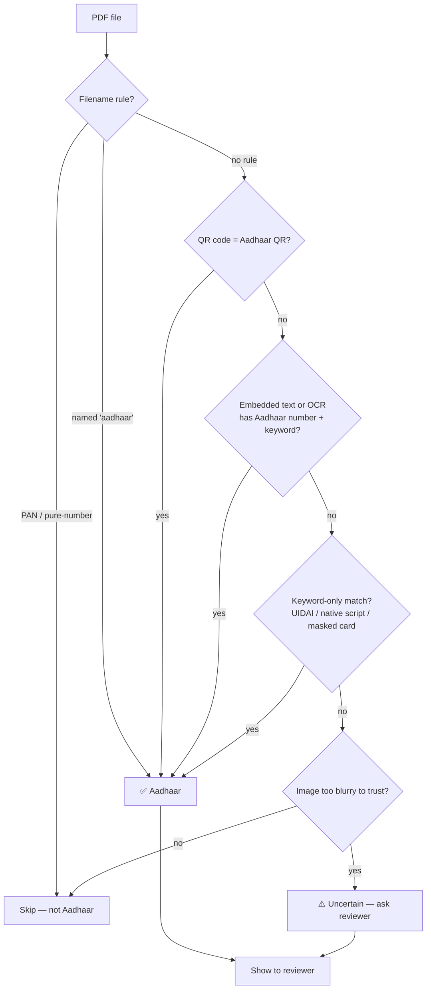
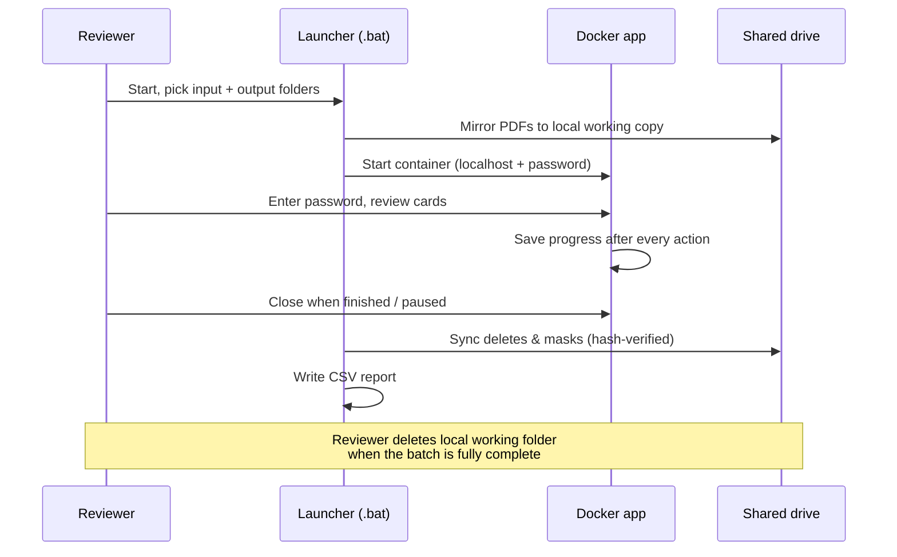

# Aadhaar Detector — Solution Overview

**A secure, offline tool for finding and handling Aadhaar cards inside large collections of PDF documents.**

---

## 1. What this solution does

Organisations often hold thousands of scanned PDFs on a shared drive. Hidden among them are **Aadhaar cards** — sensitive national‑identity documents that must not be stored or circulated carelessly.

This tool **scans every PDF, automatically identifies which ones are Aadhaar cards, and lets a reviewer decide what to do with each one** — keep it, delete it, or mask (black out) the Aadhaar number and keep the rest.

Everything runs **locally on one PC with no internet connection**. Aadhaar data never leaves the machine.

---

## 2. Key features

| Feature | Description |
|---|---|
| **Automatic Aadhaar detection** | Uses multiple detection methods (QR code, text, number checksum, multilingual keywords) to find Aadhaar cards even when scanned, rotated, or blurry. |
| **Multilingual** | Recognises Aadhaar cards in **English, Hindi, Gujarati, and Marathi**. |
| **One‑by‑one review** | A reviewer sees each detected card with a full page preview and chooses an action. Non‑Aadhaar files are skipped silently. |
| **Three actions** | **Keep** (leave unchanged), **Delete** (move out for removal), **Mask & Keep** (permanently black out the number, keep the document). |
| **True redaction** | Masking permanently removes the underlying number from the file — it is not just a black rectangle that can be peeled off. |
| **Resume after pause/crash** | Stops and restarts exactly where it left off. Progress is saved after every action. |
| **Multiple folders** | Each folder is tracked independently — you can pause one folder, work on another, and return without losing progress. |
| **Safe sync back** | Deleted and masked files are synced back to the shared drive with **hash verification** before any original is touched. |
| **Full audit trail** | Every deletion and mask is recorded in a CSV report. |
| **Runs offline** | No internet, no cloud, no external servers. Sensitive data stays on the machine. |
| **Runs in a browser via Docker** | Packaged as a Docker image; the desktop app is shown in the browser — no software install beyond Docker Desktop. |

---

## 3. How it works — the reviewer's workflow

```
1. Start the tool (double-click the launcher).
2. Pick the SHARED input folder that contains the PDFs.
3. Pick the SHARED output folder (where removed Aadhaar files are collected).
4. The tool copies the PDFs to a local working folder (avoids network issues).
5. The browser opens and asks for a password.
6. Scanning starts automatically in the background.
7. Each detected Aadhaar card appears one at a time:
        → Keep      → Delete      → Mask & Keep
8. When finished (or paused), close the app window.
9. The tool syncs results back to the shared drive and writes a report.
```

### What each action does

| Action | Effect on the shared drive |
|---|---|
| **Keep** | The file is left exactly as it was. |
| **Delete** | The file is copied to the shared **output** folder, and the matching original is removed from the shared **input** folder (only after a hash match confirms it's the same file). |
| **Mask & Keep** | The Aadhaar number is permanently blacked out, and the masked version replaces the original in the shared input folder (same name, same location). |

---

## 4. Architecture

### 4.1 Deployment architecture



### 4.2 Detection pipeline — what happens to each PDF

The tool checks the cheapest, fastest signals first and stops as soon as it is confident.



- **QR code** — Aadhaar cards carry a specific QR; works even on blurry scans.
- **Text / number** — a valid 12‑digit Aadhaar number is confirmed with the **Verhoeff checksum** (the same maths Aadhaar uses), plus supporting keywords.
- **Keyword‑only** — catches cards where the number is already masked, using words like *UIDAI*, *Government of India*, or native‑script equivalents.
- **Uncertain** — if a page is too degraded to judge, it is shown to a human rather than silently skipped.

### 4.3 Run lifecycle — what happens, when



---

## 5. Resume & multi‑folder behaviour

- **Progress is saved after every file and every action.** If the app is closed or crashes, restarting the same folder continues from the exact point it stopped — already‑reviewed files are not shown again, and already‑scanned files are not rescanned.
- **Each input folder has its own independent memory.** You can pause Folder A, process Folder B, and come back to Folder A later. They never interfere.
- **Rule for reviewers:** always open a given folder the *same way each time* (same drive/path), and don't reuse one folder for different batches — give each new batch its own folder.

---

## 6. Security — what we considered and how it is protected

Because this tool handles Aadhaar (national‑identity) data, security was treated as a first‑class requirement. The table below maps each risk we considered to the protection in place.

| # | Risk considered | Protection in the solution |
|---|---|---|
| 1 | **Someone on the network views/controls the review screen** | The screen is bound to **localhost only** — it is not reachable from any other machine on the network. |
| 2 | **Unauthorised local access to the screen** | The review screen is **password‑protected**; the password must be entered before any card is shown. |
| 3 | **Aadhaar numbers leaking into logs** | Logs never contain OCR text or Aadhaar numbers — only counts and status. The progress files also never store the number. |
| 4 | **Masking that can be undone** | Masking **permanently removes** the underlying number from the document (true redaction), not a removable overlay. |
| 5 | **Wrong file deleted / corrupt copy** | Before any original is removed, the copy is verified with a **SHA‑256 hash match**. If it doesn't match, the original is kept. |
| 6 | **Malicious/corrupt instructions writing outside the target folder** | Sync operations reject unsafe paths (no absolute paths, no `..` traversal) for **both** delete and mask operations. |
| 7 | **Data leaving the machine** | The tool is **fully offline** — no internet, no cloud, no external calls. Aadhaar data physically cannot leave the PC through the app. |
| 8 | **Network‑drive permission problems / partial writes** | PDFs are staged to a **local working copy** first; the app only ever reads/moves local files, and progress files are written atomically (never half‑written). |
| 9 | **Sensitive copies left on disk** | Documented cleanup: the entire local working folder (`client-data\staged-run`) is deleted once a batch is complete; full‑disk encryption (BitLocker) is recommended on the PC so any residual data is unreadable. |

### Why this is a secure solution now

- **No network exposure** — the sensitive review screen can only be seen from the machine itself, and only after a password.
- **No data trail** — Aadhaar numbers are never written to logs or state files, and the tool never connects to the internet.
- **Safe by verification** — nothing is deleted or replaced without a cryptographic hash check confirming the correct file.
- **Contained and auditable** — every action is recorded in a CSV report, and results are synced back deliberately rather than automatically.

---

## 7. Data handling & privacy summary

- **Where data lives during a run:** a local working copy under `client-data\staged-run\` on the operator PC.
- **What is stored long‑term:** only what the operator deliberately syncs to the shared output folder, plus CSV reports.
- **What is never stored:** Aadhaar numbers (not in logs, not in state files).
- **Cleanup:** delete the local `client-data\staged-run\` folder after a batch is finished, and empty the Recycle Bin. Enable BitLocker on the PC for defence against disk recovery.

---

## 8. Requirements

- Windows 10 / 11
- Docker Desktop installed and running
- 8 GB RAM minimum (16 GB recommended)
- Internet is required **only once** to build/load the tool; day‑to‑day operation is fully offline.

---

## 9. Running the tool

1. Ensure Docker Desktop is running.
2. Double‑click **`run_docker_staged.bat`**.
3. Select the shared **input** folder, then the shared **output** folder.
4. When the browser opens, enter the **password**.
5. Review each detected card (Keep / Delete / Mask & Keep).
6. Close the window when finished; the tool syncs results and writes a report.
7. When the batch is fully complete, delete the local `client-data\staged-run\` folder.

---

*This document describes the deployed solution and the security measures built into it. For operational build‑and‑ship steps, see `DOCKER_RUN.md`.*
